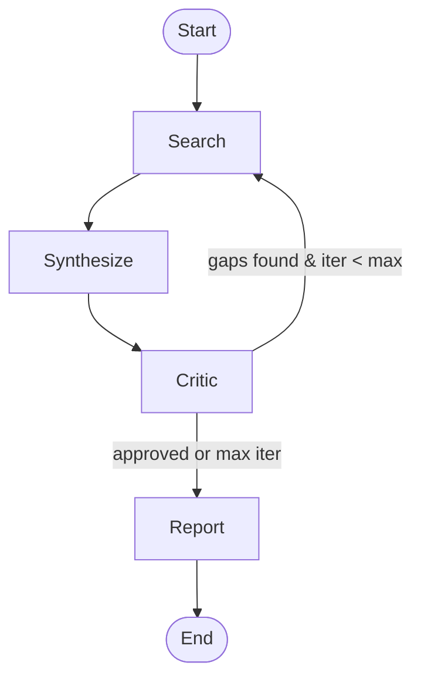

# Multi-Agent Literature Review System for Health AI Evaluation

A multi-agent system that takes a Health AI evaluation topic and produces a structured
markdown literature review with a methodology comparison table. Built with
[LangGraph](https://github.com/langchain-ai/langgraph) and the Anthropic API.

## Architecture



| Agent | Role | Tools |
|-------|------|-------|
| **Search** | Query PubMed & Semantic Scholar; dedupe results | `search_pubmed`, `search_semantic_scholar` |
| **Synthesis** | Extract structured fields from each paper's abstract | None (pure LLM) |
| **Critic** | Identify coverage gaps; decide loop-back vs. proceed | None (pure reasoning) |
| **Report** | Produce final markdown lit review with comparison table | None |

## Setup

```bash
# Clone and install
git clone <repo-url> && cd lit_review_agent
python -m venv .venv && source .venv/bin/activate
pip install -e ".[dev]"

# Configure API keys
# Edit secrets.txt with your keys (file is git-ignored)
```

## Usage

```bash
# (coming soon — Phase 3+)
python -m lit_review_agent --topic "Health AI model benchmarking with wearable data"
```

## License

MIT
